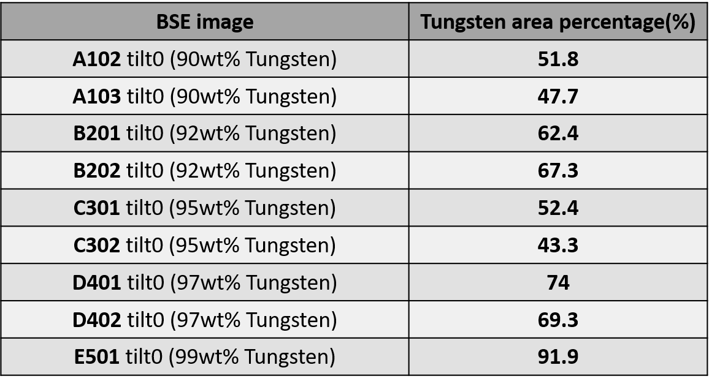

Dear editor, 

We are pleased to submit our revised version of "*Unsupervised Machine Learning in Fractography: Evaluation and Interpretation*" . A detailed response is included together with the changes that have been made to the text. The reviewers’ comments are in bold and our response is in blue font. Changes made to the manuscript are <mark>highlighted</mark>  in the manuscript. 

**<u>Reviewer #1</u>:**  **Authors investigated the application of computer vision and machine learning methods in Fractography as a tool for automatic failure analysis process and thus minimize the human-induced bias. The complex interaction between intrinsic (e.g. microstructure) and extrinsic (e.g. environment, loading history) factors cause failures.   Deep learning (DL) models are efficient in learning complex relationships in feature present in input data. Authors leveraged DL for discovering correlations and information encoded in complex geometries of fracture surfaces which are otherwise not visible.**

**Authors used an unsupervised learning pipeline to classify fracture surfaces of five tungsten heavy alloys categorized according to Tungsten percentage in them. Further, they analyzed these features on the fracture in relation to decision process.  The fractographic interpretation of such features shows the extent of plasticity on the fracture surface as tool for classification.**

**<u>Review #2</u>:** 
**In the study, the unsupervised machine learning pipeline for fractography in WHA have been studied. In this regard, two algorithms have been presented and the minimally supervised pipelines have been added to classify the clustered data points, which successfully moved on and analyzed some fracture surfaces in alloys (e. g. Tungsten heavy alloys with different Tungsten contents).  Although the research fills the gap in the literature regarding on machine learning algorithm directed at clustering fracture surfaces, the article lacks adequate discussion on the results.  In addition, some imprecision in the results were found. Some major comments are listed below:**

**In Figure 1 and the following figure 12, all the SEM fracture images from WHA samples lack of scale bar, which may bring imprecision since the size and morphology of dimples are essential characters for fracture research in alloys.**

 The scale bars have been accidentally omitted. The figures in the revised version have been mended and include the scale bars. 

We also wish to note that all of the images used for this study were taken at the same resolution of 4096x4096 pixels spanned overa  $600\mu m$ viewfield.  

**In the manuscript, the benchmark, especially the data recognition, for evaluating and classifying the images for fracture need better interpretation.**

 First we wish to thank the reviewer for pointing out that some parts of the work are not sufficiently clear to the reader. We are not certain what the reviewer meant by better interpretation, however we do understand from this comment that some portions of our paper, specifically those related to the outputs of the proposed pipeline are not clear enough.

 We have made the following modifications to the manuscript : 

 **Section 3.1** 

On page 13, the paragraph : 

> The dataset of 810 SEM images, obtained by fracture experiments on the WHA samples with different tungsten composition, is imported to the clustering data pipeline and the resulted 2D scatter plot is shown in Fig. 4.

was modified to:

> The dataset of 810 SEM images, obtained by fracture experiments on the WHA samples with different tungsten composition, is imported to the clustering data pipeline and the resulted 2D scatter plot is shown in Fig. 4.  Each image is represented by a point in the 2D space and colored by the clustering algorithm, which assigns each point to one of the five classes (i.e. Tungsten percentage in the original sample).

On page 14, the paragraph :

> Subsequently, in order to quantify the performance of the algorithm the data points are plotted with their ground truth labels (Fig. 5)

was modified to:

> Subsequently, in order to quantify the performance of the algorithm the data points are plotted with their ground truth labels (i.e. colored by the sample they came from), while the coordinates in the 2D reduced space (Fig. 5) are the same as in Fig. 4. 

On page 14, the paragraph :

> The ground truth plot shows that the algorithm fails to cluster correctly the data points that belong to the first SEM fracture image of the sample with 90wt $\%$ tungsten composition; for each tungsten composition sample two SEM images were obtained and then cropped before added to the dataset, as it was explained in the beginning of the previous section. The erroneous predictions are marked (see crossed data points in Fig. 5) and the accuracy of the algorithm is computed to 81.2 $\%$.

was modified to:

> The ground truth plot shows that the algorithm fails to cluster correctly the data points that belong to the first SEM fracture image of the sample with 90wt $\%$ tungsten composition (i.e. blue points in Fig. 5 were colored otherwise in Fig. 4 and embedded in clusters describing the WHA92 and WHA97 samples); for each tungsten composition two SEM images were obtained and then cropped before added to the dataset, as it was explained in the beginning of the previous section. The erroneous predictions are marked (see crossed data points in Fig. 6) and the accuracy of the algorithm is computed to 81.2 $\%$.

On page 14, the paragraph:

> Additionally, the confusion matrix presented in Fig. 7 verifies that the main source of clustering errors is the data points that originate from the first SEM fracture image of the  sample with 90wt $\%$ tungsten composition.

was modified to:

> In Fig. 7, we present the confusion matrix which was construct group wise. The confusion matrix' entries are the measured  frequency of predicting the label on the $x$ axis for an image originating from the label on the $y$ axis. The confusion matrix presented in Fig. 7 verifies that the main source of clustering errors is the data points that originate from the first SEM fracture image of the  sample with 90wt $\%$ tungsten composition, which was identified as WHA97 in 35 $\%$ of the cases and WHA92 in 13 $\%$ of the cases. 

 **Section 3.2** 

On page 18, right before section 3.3 we have added clarification to the statement regarding the lowest accuracy: 

> The accuracy of the classification predictions is computed to 93 $\%$, while in numerous tests performed on the same dataset the lowest accuracy was 85 $\%$.  

 which now reads: 

>The accuracy of the classification predictions is computed to be 93 $\%$, for the test and training sets demonstrated in Fig. 11. We have conducted numerous tests in which the test and training tests were randomly selected and of which the lowest accuracy was 85 $\%$.

 **Section 3.3** 

The title of section 3.3 was modified from 

> Comparison with Haralick texture descriptors method

to 

> Comparison with other methods

The following was added to section 3.3 as a second paragraph:

> To highlight the strength of the proposed method we have compared the obtained accuracy with two other methods. 
>
> The first form of analysis we have considered as an alternative to our method, is to simply take back-scattered electron images of the fracture surfaces, and quantify the relative area fraction of  the bright (W) and dark (NiFe) regions via binary segmentation. The results of this test are summarized in Table 2. Evidently, the measured Tungsten area fraction fails to serve as a tool for classification of the fracture surfaces. 

The beginning of the discussion regarding Haralick texture descriptors was modified to read: 

> Next, we compare the proposed methodology accuracy with that of a well established image analysis method, based on the image texture. Our WHA dataset is imported into an algorithm that extracts different texture descriptors
> and consequently enable image classification, following the method proposed by Haralick et al. (1973).  

And the comparison between the methods was slightly altered to read:

> The performance of the Haralick texture descriptors algorithm on the WHA fracture images dataset is very poor, with classification accuracy of 21 $\%$. Practically, this evaluation shows that the algorithm, which is based on a well-established method commonly used  for image classification, fails to classify the fracture images of the WHA dataset and reveals the complexity of the task at hand. While the Haralick texture descriptors are known measures, their suitability for a given classification task is strongly dependent on the texture variations existing in the images at hand. On the other hand, the proposed method is able to identify the features which set the different classes apart and is thus more flexible.  
>
> The comparisons presented in this section,  demonstrate the great potential of the Clustering and Classification algorithms that are presented in this paper and makes more evident the importance of their high efficiency performance.

 **Section 3.4** 

On page 20, lines 14-18 were modified from:

> The eigenvalues express the total variance of the linear combinations of the feature vectors ($\vec{a}_c$) with the computed eigenvectors ($\vec{u}_k$), which are called \textit{Principal Components} 

To:

> The eigenvalues express the total variance of the linear combinations of the feature vectors ($\vec{a}_c$) with the computed eigenvectors ($\vec{u}_k$), which are called _Principal Components_. The principal components are ordered in such a way that the first principal component (that is, a linear combination of $n$ features from  $\vec{a}_c$) contains more information than all components to follow, the second contains as much of the remaining information etc. . The mathematical definition of the principal components is given by:

On page 20, the paragraph starting from line 56  was modified from

>Following this analysis becomes apparent that for each input fracture image $c$ of the WHA dataset, the weighted, by the coefficients of the eigenvector of the first principal component, sum of all the activation maps exported by the final convolution layer will show the exact features of the input image that are utilized by the clustering algorithm in the process of grouping this image with the rest of the images in the WHA fracture images dataset. This conclusion is mathematically defined as follows:

To 

> Following this analysis becomes apparent that for each input fracture image $c$ of the WHA dataset, the weighted (by the coefficients of the eigenvector of the first principal component) sum of all the activation maps exported by the final convolution layer will show the exact features of the input image that are utilized by the clustering algorithm in the process of grouping this image with the rest of the images in the WHA fracture images dataset. 
>
> In other words, to get a visual glance at the inner working of the clustering and classification algorithm, we can color the fracture surface images such that the regions making the larger contribution to the algorithm's ability to classify them as belonging to one of the classes will be highlighted. 
>
>  This conclusion is mathematically defined as follows:

We sincerely hope that the above listed modifications to the manuscript has made it clearer for future readers 

**The authors proposed two question in the manuscript. And the second one is the new correlations between the fracture surface roughness and the fracture toughness. What is correlations in this work?**

 The reviewer's question relates to the question phrased on page 5 line 12, namely:

> What are they good for

 As noted in the introduction the two questions phrased in the introduction are what we perceive as  the two barriers the community need to over come for machine-learning approaches to make their was into fractographic analysis in a more wide spread manner. Indeed, under the $1^{st}$ question *what are they good for* we have listed the possibility of establishing new correlations between fracture surfaces and the fracture toughness. **However**, this is mentioned merely as a future direction, which we strongly believe can be attained. In fact, much of our recent efforts are directed towards this goal and we hope to be able to share them with the community in the near fracture. 

In the context of the work submitted for publication, we have not touched on such correlations simply because we did not have the tools to do so at the time of submissions (almost 12 months ago). While we are now approaching the capability of dealing with that, even now we are not there yet. 

We sincerely hope that the reviewer will understand our eagerness to explain in the introductory section to which direction we think such tools should proceed, despite the fact that this is outside the scope of the manuscript. 

 On behalf of the authors, 

Shmuel Osovski
